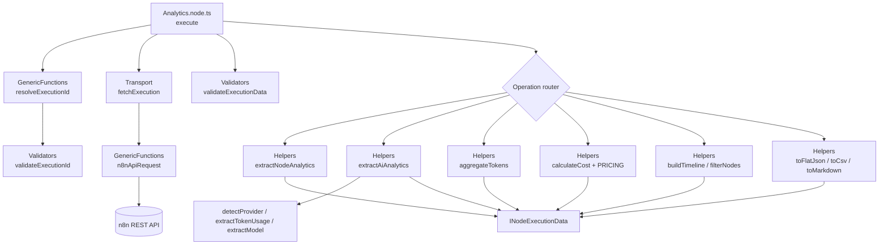

# n8n-nodes-analytics

A powerful [n8n](https://n8n.io) community node that replaces complex 10–20 node analytics workflows with a **single reusable node**. It fetches execution data through the n8n API, automatically detects AI/LLM nodes, calculates token usage and cost analytics, and outputs structured results in multiple formats.

[Installation](#installation) · [Credentials](#credentials) · [Operations](#operations) · [AI Token Analytics](#ai-token-analytics) · [Cost Analytics](#cost-analytics) · [Architecture](#architecture)

---

## Features

- 📊 **8 operations** covering execution, workflow, node, timeline, token, model and cost analytics
- 🤖 **Automatic AI node detection** — no configuration needed; works with OpenAI, Anthropic, Gemini, Mistral, Groq, Ollama, OpenRouter, Cohere, DeepSeek and any LangChain LLM node
- 🔢 **Provider-agnostic token extraction** — normalizes `input_tokens`/`output_tokens`, `prompt_tokens`/`completion_tokens`, cached and reasoning tokens
- 💰 **Cost estimation** with a built-in pricing table, fuzzy model matching, custom pricing overrides and multi-currency output
- 📤 **Multiple export formats** — JSON, flat JSON, CSV, Markdown
- ⚡ **Single-pass, Map-based aggregation** — one traversal of `runData`, lazy evaluation per operation

---

## Installation

### Community Nodes (recommended)

1. In n8n, go to **Settings → Community Nodes**.
2. Select **Install**.
3. Enter `n8n-nodes-analytics` and confirm.

### Manual / npm

```bash
npm install n8n-nodes-analytics
```

For local development:

```bash
git clone <this-repo>
cd n8n-nodes-analytics
npm install
npm run build
# link into your n8n custom nodes directory
```

---

## Credentials

The node authenticates against the n8n REST API using an **n8n API** credential.

1. In n8n, open **Settings → API** and create an API key.
2. In the credential, set:
   - **Base URL** — your n8n instance URL, e.g. `http://localhost:5678` (no trailing slash)
   - **API Key** — the key you just created

The credential is verified automatically against `GET /api/v1/executions`.

> The API key is sent as the `X-N8N-API-KEY` header. All requests go to `{{baseUrl}}/api/v1/...`.

---

## Operations

Select the **Execution Analytics** resource, then one of the following operations. Every operation accepts an **Execution ID**, or enable **Use Current Execution** to analyze the running execution.

| Operation | Description | Key parameters |
| --- | --- | --- |
| **Analyze Execution** | Fetch and analyze a single execution (summary of status, duration, node & AI counts, errors) | — |
| **Token Summary** | Extract AI token usage across all AI nodes | `Group By`: none / provider / model / workflow / node |
| **Workflow Summary** | Workflow-level metadata & stats | — |
| **AI Model Summary** | Per-model breakdown of AI usage | — |
| **Cost Summary** | Estimate costs from token usage | `Cost Source`, `Currency`, `Custom Pricing` |
| **Node Statistics** | Per-node execution stats | `Filter`: all / ai / failed / successful / trigger / http |
| **Execution Timeline** | Ordered timeline of node executions | — |
| **Export Analytics** | Full analytics in a chosen format | `Output Format`: json / flatJson / csv / markdown |

### Advanced Options (collection)

Toggle what appears in the output:

- Include Token Usage
- Include Costs
- Include Errors
- Include Node Timing
- Include Workflow Metadata
- Include AI Metadata
- Include Raw Execution *(attaches the full raw execution — large)*

---

## AI Token Analytics

AI nodes are detected two ways, so the node keeps working as new integrations appear:

1. **Node type matching** — known LangChain / base LLM node types (`lmChatOpenAi`, `lmChatAnthropic`, `lmChatGoogleGemini`, `lmMistral`, `lmChatGroq`, `lmOllama`, `lmChatOpenRouter`, …) and any type containing `langchain`, `lm`, `ai`, `agent`, `embeddings`, or a provider name.
2. **Output inspection (future-proof fallback)** — any node whose output contains a `tokenUsage` / `usage` / `token_usage` object (found recursively) is treated as an AI node.

Token fields are normalized across providers:

| Provider field | Normalized to |
| --- | --- |
| `prompt_tokens`, `input_tokens` | `prompt_tokens` |
| `completion_tokens`, `output_tokens` | `completion_tokens` |
| `prompt_tokens_details.cached_tokens`, `cache_read_input_tokens` | `cached_tokens` |
| `completion_tokens_details.reasoning_tokens` | `reasoning_tokens` |
| `total_tokens` (or derived `prompt + completion`) | `total_tokens` |

### Provider support matrix

| Provider | Detected by |
| --- | --- |
| OpenAI | `openai`, `gpt`, `o1`, `o3`, `davinci` |
| Anthropic | `anthropic`, `claude` |
| Google Gemini | `google`, `gemini`, `palm`, `vertex` |
| Mistral | `mistral`, `mixtral` |
| Groq | `groq` |
| Ollama | `ollama` |
| OpenRouter | `openrouter` |
| Cohere | `cohere` |
| DeepSeek | `deepseek` |
| *others* | falls back to `Unknown` (tokens still counted) |

---

## Cost Analytics

Costs are estimated from the built-in pricing table (USD per **1M tokens**), with fuzzy prefix matching so versioned model names like `gpt-4o-2024-08-06` resolve to `gpt-4o`.

| Model | Prompt | Completion |
| --- | --- | --- |
| gpt-4o | 2.50 | 10.00 |
| gpt-4o-mini | 0.15 | 0.60 |
| gpt-4-turbo | 10.00 | 30.00 |
| o1 | 15.00 | 60.00 |
| claude-3-5-sonnet | 3.00 | 15.00 |
| claude-3-opus | 15.00 | 75.00 |
| claude-3-haiku | 0.25 | 1.25 |
| gemini-1.5-pro | 1.25 | 5.00 |
| gemini-1.5-flash | 0.075 | 0.30 |
| mistral-large | 2.00 | 6.00 |
| llama-3-70b | 0.59 | 0.79 |
| deepseek-chat | 0.27 | 1.10 |

*(abbreviated — see [`Helpers.ts`](nodes/Analytics/Helpers.ts) for the full table)*

- **Cached tokens** are billed at 50% of the prompt rate and excluded from the full-price prompt total.
- **Custom pricing** (Cost Source → *Custom Pricing*) is merged over the built-in table:
  ```json
  { "my-model": { "prompt": 1.0, "completion": 2.0 } }
  ```
- **Currency** — costs are computed in USD then converted (USD, EUR, NPR, GBP, INR) for display convenience.

---

## Architecture



| File | Responsibility |
| --- | --- |
| [`Analytics.node.ts`](nodes/Analytics/Analytics.node.ts) | `INodeType` + `execute()`, operation routing |
| [`Description.ts`](nodes/Analytics/Description.ts) | UI definition (resource, operations, parameters) |
| [`Transport.ts`](nodes/Analytics/Transport.ts) | Fetch execution via the API |
| [`GenericFunctions.ts`](nodes/Analytics/GenericFunctions.ts) | API request helper, ID resolution, duration/date utils |
| [`Helpers.ts`](nodes/Analytics/Helpers.ts) | AI detection, token/cost engine, aggregation, formatters |
| [`Validators.ts`](nodes/Analytics/Validators.ts) | Input & data validation |
| [`credentials/N8nApi.credentials.ts`](credentials/N8nApi.credentials.ts) | n8n API credential |

---

## Development

```bash
npm install
npm run lint      # ESLint (TypeScript)
npm run build     # tsc + copy icons to dist
npm test          # Jest unit tests
npm pack          # produce the publishable tarball
```

Unit tests cover token extraction across provider formats, provider detection, cost calculation (built-in + custom + currency + cached discount), aggregation by every group-by mode, export formatters, filters, timeline ordering, and end-to-end extraction over an execution fixture.

---

## Changelog

### 1.0.0
- Initial release: 8 operations, automatic AI node detection, token normalization, cost estimation with custom pricing & multi-currency, and JSON/flat-JSON/CSV/Markdown export.

---

## License

[MIT](LICENSE)
